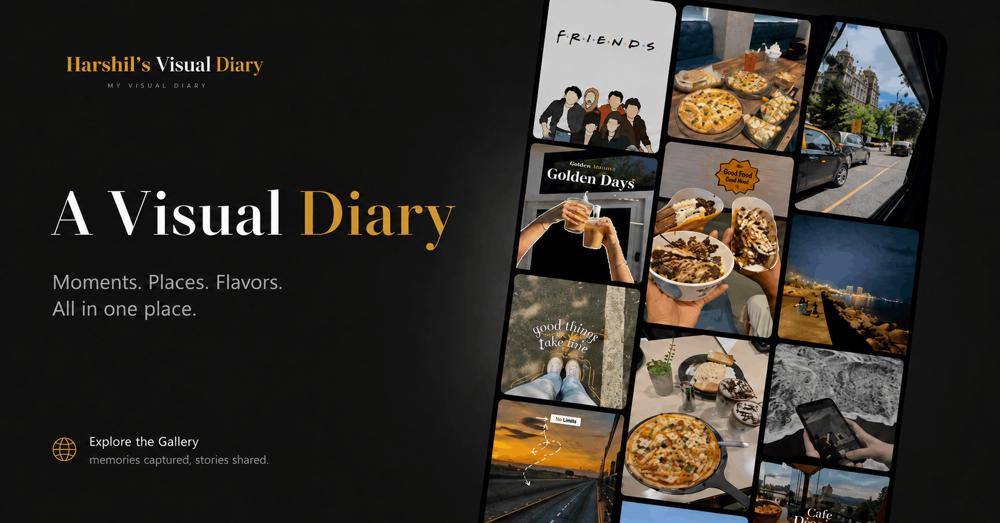

# Visual Gallery

A clean visual diary built with HTML, CSS, and JavaScript.

This project showcases a styled image gallery of moments, places, and flavors in a polished web presentation.

## What is included

- `index.html` — page structure and gallery layout
- `style.css` — custom visual styling and layout design
- `script.js` — interactivity for the gallery experience
- `images/` — gallery content and preview assets

## How to use

Open `index.html` in a browser to view the gallery.

## Preview

